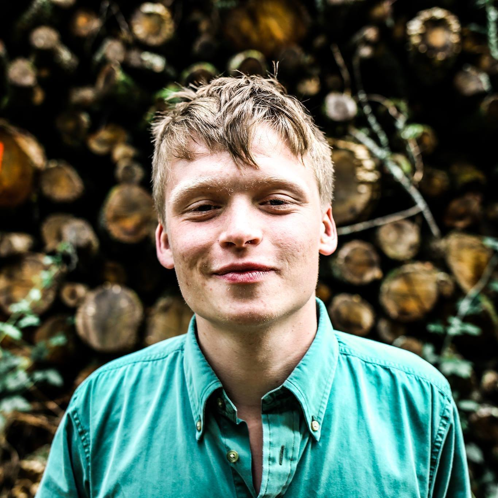

<h1 align="center"> Would They Lie to You? </h1>

<b> Think you can spot fake news? Get woke. 
</b>

## The Team

<table style="width:100%">
    <tr>
        <td>Name</td>
        <td>Email</td>
        <td>Role</td>
        <td>Photo</td>
    </tr>
    <tr>
        <td><a href="https://github.com/Davospike" target="_blank">Daniel Davies</a></td>
        <td>d.davies.2020@bristol.ac.uk</td>
        <td>Front-end</td>
        <td></td>
    </tr>
    <tr>
        <td><a href="https://github.com/vinigibilaro" target="_blank">Vincenzo Gibilaro</a></td>
        <td>ar20516@bristol.ac.uk</td>
        <td>Back-end</td>
        <td></td>
    </tr>
    <tr>
        <td><a href="https://github.com/numberonepikey" target="_blank">Jack Pike</a></td>
        <td>jp13087@bristol.ac.uk</td>
        <td>Front-end</td>
        <td></td>
    </tr>
    <tr>
        <td><a href="https://github.com/hs14428" target="_blank">Harry Smith</a></td>
        <td>hs14428@bristol.ac.uk</td>
        <td>Front-end</td>
        <td></td>
    </tr>
    <tr>
        <td><a href="https://github.com/nwtay" target="_blank">Nathan Taylor</a></td>
        <td>nt17118@bristol.ac.uk</td>
        <td>Back-end</td>
        <td></td>
    </tr>
</table>

## **The Product**

This project aims to challenge and test awareness on the topic of fake news in media on the internet, as well as demystifying current global events. The project will be largely targeted at those that consume large amounts of new information from web sources and social media. We will aim to not only educate a user on how damaging fake news can be to society, but also allow users to compare themselves to the rest of the players who have visited the application.  

The application will be for a desktop environment and integrates play via a quiz-based interface, whereby users choose whether they thought a particular news article resembled true or fake news. The application will present data on fake news in an engaging manner.  

We assume a challenge would come about when trying to store user inputs and presenting that data to a new user. Another includes converging APIs/DBs from different sources, since we want to categorise Fake News into big, current topics. Another challenge might involve filtering data using datapoints and tagging.

https://user-images.githubusercontent.com/72808876/116984108-cbeef480-acc2-11eb-9623-ba0c66fce88f.mov

## The Process
Throughout the journey we have been documenting the process as we go to help drive the project creating. As such you can read about our journey by following the links below.
View our design process and documentation [here](The_Process/SystemDesign.md)

### 1. [System Design](The_Process/SystemDesign.md)
View our system design page to find out about:

- Our reasons and motivations behind the project
- Background and research on fake news
- Idea generation and design conceptualization
- UX approach
- Stakeholders and user stories
- UI paper prototyping, wireframes and user surveys/feedback

### 2. [System Implementation](The_Process/SystemImplementation.md)
Read about how we worked as a team to reach our end goal here. Key areas:

- Why we decided on following an agile approach
- Project management and sprints
- How we implemented the MEAN stack to develop a fake news SPA
- Deployment details

### 3. [Project Evaluation](The_Process/ProjectEvaluation.md)
In order to improve, evaluation is critical. Key areas:

- How we evaluated and tested as we went
- User acceptance testing
- Reflection on the project and our working practices
- Discussion of further work

### 4. [Deploying The SPA](Example_Code/AngularQuizApp)
Our website ecosystem is contained the AngularQuizApp folder in the Example_Code directory. To run and deploy the application in Docker:

- Run the `deploy.sh` script or
- `docker-compose up --build -d` on your command line

### 5. [Prototypes, notes et. al](Documentation)
Here you can view our initial paper prototype and latest wireframe representations as well as being able to view lots of our early ideas, notes, logs and images.
## Built with the MEAN Stack

- **M**ongoDB document-oriented database program
- **E**xpress backend web application framework
- **A**ngular frontend web application framework
- **N**ode.js backend JS runtime environment
