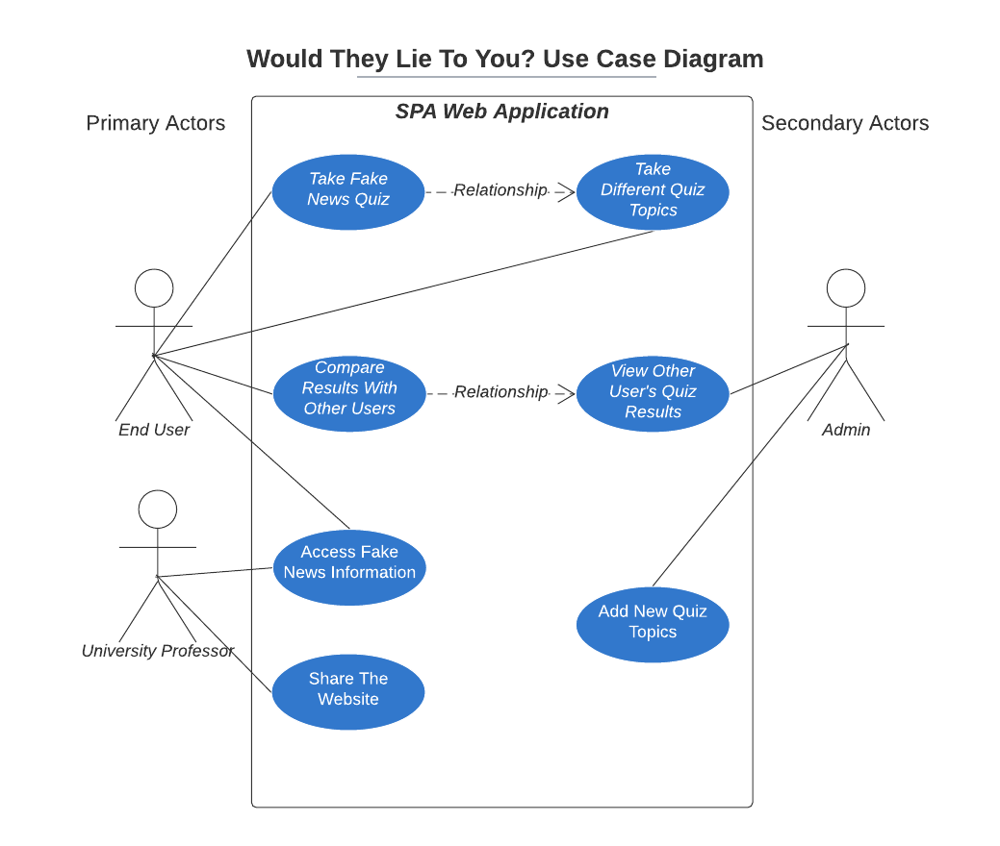

<h1 align="center"> System Design </h1>

## Table of Contents

- [Introduction](#introduction)
- [Background & Motivation](#background--motivation)
   - [Current State of Industry](#current-state-of-industry)
   - [Why Does Fake News Education Matter](#why-does-fake-news-education-matter)
- [Product Requirements](#product-requirements)
   - [Idea Generation](#idea-generation)
   - [Stakeholders & User Stories](#stakeholders--user-stories)
      - [End User](#end-user)
      - [University Professor](#university-professor)
      - [Admin](#admin)
- [Design Process & Early Prototyping](#design-process--early-prototyping)
   - [Design Methods](#design-methods)
   - [Paper Prototypes & Wireframes](#paper-prototypes--wireframes)
   - [User Feedback & Questionnaires](#user-feedback--questionnaires)
- [System Architecture & Design](#system-architecture--design)
   - [Class Diagram](#class-diagram)
   - [Sequence Flow Diagram](#sequence-flow-diagram)

## Introduction
Fake news consists of false stories that appear to be news, which are spread on the internet and social media. In the last five years there has been an explosion in the amount of fake news being spread and due to much of it being believable, it has become more difficult for people to detect. Whilst there are numerous sites explaining the danger of fake news and how to spot it, there are fewer that provide a way for people to check whether they are susceptible to it, and even fewer that combine the two aims.

Thus, we not only aimed to create a site that would educate people about fake news in terms of what it is, its history, the dangers, and how to recognise it, but one that would also allow users to test whether they can detect fake news based on an article presented to them. 

The crux of the site is a quiz with various topics that have been popular targets for fake news. Users select a topic and are presented with several questions and articles, they are then tasked with identifying the articles as real news, or fake news. Upon answering all the questions and completing the quiz, the user is presented with their final score and they are offered a chance to visit the site where the article originated.

Our project objectives were established early on in our [group scoping discussion](https://github.com/Davospike/segpSPA/blob/dan/Documentation/Scoping/GroupScopingDiscussion.md) and were set out as follows:

**Primary Objectives:**

- Develop an educational quiz, tasking users with identifying fake news

- Use the webpage to inform users about fake news; what it is, its history, the dangers of it, and how to recognise it

- Create a static database that holds a handpicked selection of news articles that are identified as being fact or fiction

**Secondary Objectives:**

- Collect and store user data, such as their quiz score and where they obtain their news from

- Create a login function for the site so users are encouraged to revisit and compare previous scores

- Create a function that allows users to share their score via social media

[ADD VIDEO]

## Background & Motivation
Fake news is a false narrative that is published and promoted as if it were true. Historically, fake news was usually propaganda put out by those in power to promote a certain belief or support a certain position, even if it was completely false. Social media has now created an environment where anyone with an agenda can publish falsehoods as if they were truths. People can be paid to post fake news on behalf of someone else or automated programs, often called bots, can publish auto-generated fake news.

In 2013 the World Economic Forum saw the dissemination of fake news via social media as an emerging danger ([WEF, 2013](http://www3.weforum.org/docs/WEF_GlobalRisks_Report_2013.pdf)). The report stated that even if factually correct information follows, the damage that disinformation could cause would be difficult to correct, especially when spread in "opaque" social networks where public information is less visible, such as Facebook ([Keller, 2012](https://www.bloomberg.com/news/articles/2012-10-31/how-truth-and-lies-spread-on-twitter)).

### Academic Research Review
The term "fake news" has its origins in the 19th century, yet it has only come back into the public mind in the last 5 years, with Collins Dictionary announcing it as their word of the year in 2017 ([Collins, 2017](https://blog.collinsdictionary.com/language-lovers/collins-2017-word-of-the-year-shortlist/)). There has been a proliferation of falsehoods and misinformation throughout time, but the difference today is that the speed at which information can spread and thus its global reach has increased drastically ([Niklewicz, 2017](https://www.msb.se/RibData/Filer/pdf/28697.pdf)). This, combined with the increased complexity and scale of disinformation along with increased forms of communication, has led to a growth in the amount of fake news circulating ([Blumler, 2015](http://commres.net/wiki/_media/comt12077.pdf)). The rapid adoption and growth of social media has given many the ability to not only create but spread information that is factually incorrect through decentralised platforms ([Benkler et al., 2018](https://oxford.universitypressscholarship.com/view/10.1093/oso/9780190923624.001.0001/oso-9780190923624)). This growth of fake news has led us into an era of information warfare, with social media being utilised as a weapon to run direct campaigns of disinformation, and the effects of this spread has the potential to have a devastating impact on everyday life ([Zannettou et al, 2019](https://arxiv.org/pdf/1804.03461.pdf)), with politics, societal issues, science, and economics all coming under threat from fake news. 

Some such as Alex Gelfert and Bente Kalsnes state this rise in fake news, both as a term and the disinformation itself, is due to the Brexit referendum and the 2016 US presidential election ([Gelfert, 2018](https://www.erudit.org/en/journals/informallogic/1900-v1-n1-informallogic04379/1057034ar/abstract/); [Kalsnes, 2018](https://oxfordre.com/communication/communication/view/10.1093/acrefore/9780190228613.001.0001/acrefore-9780190228613-e-809)). During the 2016 election, fake news was spread across the internet and gained wide attention, with social media playing a leading role in the dissemination of fake news. It was found that in general, fake news outperformed real news on Facebook, with the most popular fake news election stories generating more engagement than the top real stories from 19 mainstream news outlets combined ([Silverman, 2016](https://www.buzzfeednews.com/article/craigsilverman/viral-fake-election-news-outperformed-real-news-on-facebook)). Three fake news stories gained two million Facebook engagements, whilst at the same time, the most popular New York Times piece only gained 370,000 ([Ritchie, 2016](https://www.cnbc.com/2016/12/30/read-all-about-it-the-biggest-fake-news-stories-of-2016.html)). Similar studies in Israel ([Yaron, 2018](https://www.haaretz.com/israel-news/.premium.MAGAZINE-the-online-dangers-threatening-fair-elections-in-israel-1.6455522)), Nigeria ([Kazeem, 2018](https://qz.com/africa/1478737/fake-news-media-collaborate-ahead-of-nigeria-2019-election/)), Australia ([Kušen & Strembeck, 2018](https://www.sciencedirect.com/science/article/pii/S2468696417301088)) and Italy ([Serhan, 2018](https://www.theatlantic.com/international/archive/2018/02/europe-fake-news/551972/)) have all recognised the impact that fake news has had on their elections. 

Some major consequences of the spread of disinformation is the rise of fear, hate, uncertainty, and racism. In studies from the United States ([Bursztyn et al., 2018](https://www.socialscienceregistry.org/trials/3066/history/34003)) and Germany ([Müller & Schwarz, 2017](https://papers.ssrn.com/sol3/papers.cfm?abstract_id=3082972)), they found that fake news spread via social media was linked to an increase in hate crimes against minorities. In the United Kingdom, King's College and Ipsos MORI discovered that there are "significant misperceptions" around Brexit, with people not only believing that a rise in European immigration leads to a decrease in the quality of healthcare services, but also leads to an increase in crime ([King's College & Ipsos MORI, 2018](https://ukandeu.ac.uk/wp-content/uploads/2018/10/Brexit-misperceptions.pdf)). One infamous instance of fake news not only affecting democracy but also human lives, is "Pizzagate" ([Aisch et al., 2016](https://www.nytimes.com/interactive/2016/12/10/business/media/pizzagate.html)). What began as a tweet was then posted on fake news websites, which lead to the story spreading rapidly on social media and culminated in someone firing an assault rifle into a pizzeria. 

The spread of pseudoscience through fake news can have an immense impact on people's lives and can exacerbate disasters. One such example arose during the COVID-19 pandemic, which has been the target of an immense amount of fake news, so much that the head of WHO said "We're not just fighting an epidemic; we're fighting an infodemic" ([Brennen & Nielsen, 2020](https://reutersinstitute.politics.ox.ac.uk/risj-review/covid-19-has-intensified-concerns-about-misinformation-heres-what-our-past-research)). Due to fake news, some people believe that the effects of the virus, along with the death rates caused by it, have been inflated. This led to many believing that there was no reason to adhere to social distancing or lockdown measures which were intended to reduce the impact of the virus, ultimately leading to a higher death toll ([Lynas, 2020](https://allianceforscience.cornell.edu/blog/2020/04/covid-top-10-current-conspiracy-theories/)). Disinformation surrounding climate change can have a negative impact on environmental policies. Bob Ward argues that the failure of the mainstream press in ensuring only the most accurate information is published has numerous consequences, such as harming the public interest and placing people at greater risk from the impact of climate change ([Ward, 2018](https://www.lse.ac.uk/GranthamInstitute/news/another-failure-to-tackle-fake-news-about-climate-change/)). 

Not only can fake news compromise public economic growth, but also invidiuals' benefits. One major target of disinformation  has been 5G, with Reuters claiming that there have been arson attacks and assaults on 5G masts in at least 10 European countries ([Chell, 2020](https://www.reuters.com/article/us-eu-telecoms-5g/combat-5g-covid-19-fake-news-urges-europe-idUSKBN2392N8)) as people believe they spread coronavirus. This has led to need for the World Health Organisation to publish articles that contradict fake news, with the WHO stating that "viruses cannot travel on radio waves" ([WHO, 2021](https://www.who.int/emergencies/diseases/novel-coronavirus-2019/advice-for-public/myth-busters)). Fake news also impacts businesses and consumers, as fake reviews can and do increase confusion and distrust in the business owner and negatively affect the purchasing process ([Valant, 2015](https://www.eesc.europa.eu/resources/docs/online-consumer-reviews---the-case-of-misleading-or-fake-reviews.pdf); [Fornaciari et al., 2014](https://core.ac.uk/download/pdf/74372819.pdf)) 

### Current State of Industry
[ADD TO] - Dan

### Why Does Fake News Education Matter
The spread of fake news should be a worry for all and people should take an active role in teaching themselves how to recognise it. In one studiy it was found that humans are only 4% better than chance (50%) at distinguishing fact from fiction ([Bond & DePaulo, 2006](https://journals.sagepub.com/doi/pdf/10.1207/s15327957pspr1003_2)). It is important to try and increase those chances so people are less susceptible to fake news and the best way to achieve this is to educate. 

Many publishers who create and share these stories are simply in it for "the clicks", as the more traffic their websites gain,         the more money they can make. This is known as "clickbait" and it appeals to many due to sensationalised headlines. Some are more insidious and want to sway public opinion by spreading news that appeals to certain beliefs. This is especially poignant during the US elections, especially in 2016, when fake news about certain candidates was spread and impacted the way people voted ([Allcott & Gentzkow, 2017](https://web.stanford.edu/~gentzkow/research/fakenews.pdf)). Some politicians and influential individuals began to call legitimate news fake, which can lead people to be confused about what is true and in turn can lead to the proliferation of actual fake news.

It's been found that people are more likely to see the opposite party as more susceptible to disinformation than their own ([Jang & Kim, 2018](https://www.sciencedirect.com/science/article/pii/S0747563217306726)). This is compounded by the fact that people will often accept information that reflects their own views and beliefs more easily, than information that contradicts what they believe in ([Flynn et al., 2017](https://onlinelibrary.wiley.com/doi/10.1111/pops.12394)). This is known as confirmation bias, or an echo chamber. 

One major problem with fake news is that despite many of these stories not being fact-checked, they are still shared by individuals and organisations who believe they are true. If they have a large following these falsehoods can often be taken more seriously and spread further, leading to the wider dissemination of fake news ([Mena et al., 2020](https://journals.sagepub.com/doi/full/10.1177/2056305120935102)). This has been especially poignant during the COVID-19 pandemic, as conspiracy theorists have used the opportunity to spread false information about the virus. One such example, is 5G. Despite there being no links between 5G and coronavirus, there have been multiple attacks on 5G masts and the UK government has been forced to address the issue, with the theories being called "dangerous nonsense" ([Faulconbridge & Holton, 2020](https://www.reuters.com/article/us-health-coronavirus-britain-5g-idUSKBN21M0MS)). Whilst much of this fake news was initially spread via social media between non-influential individuals, there have been numerous celebrities with a reach of millions who have furthered such unsubstantiated claims ([Naeem et al., 2020](https://www.ncbi.nlm.nih.gov/pmc/articles/PMC7404621/)). The problem with this is that what these influential individuals say is often believed by their followers without any second guessing and herein lies the problem; many are willing take the information offered to them at face value.

Technology has played a major role in making the spread of fake news much easier ([Kreps, 2020](https://www.brookings.edu/wp-content/uploads/2020/06/The-role-of-technology-in-online-misinformation.pdf)). What was once thought of as a relatively reliable source of news due to the difficulties people had faking them, was video. Yet, due to the creation of a new technology, <i>deepfakes</i>, the reliability of video sources can now more easily questioned. A deepfake is a video that has been generated by computer software. Many current examples of deepfakes involve placing the head of someone famous onto another's body and whilst many simply involve having the deepfake sing, as the technology becomes more developed and understood, it could lead to a new generation of fake news in which "deepfaked" politicians are made to say whatever the creator wants and the fakes will become harder to detect. 

Thus, fake news education matters because it is vital to stem misinformation and disinformation early so that people's beliefs are not based on or led by falsehoods. The spread of fake news across the internet and social media is only going to get worse as more people create accounts and the technology becomes more sophisticated, cheaper and easier to use. With the onset and development of deepfakes, bot powered videos will allow for the greater spread of disinformation. Social media and tech in general is unlikely to go under self-reform, as the more engagements that is generated on their sites, the more money they make. Thus at present, there is no incentive for them to combat fake news. It is left to the individual to think critically, evaluate the information presented to them, understand its provenance and the desired impact of it. 

There are ways for individuals to increase their chances of not falling vitcim to fake:

- Understand what fake news is: 

   
<blockquote cite="https://www.dictionary.com/browse/fake-news">"false news stories, often of a sensational nature, created to be widely shared or distributed for the purpose of generating revenue, or promoting or discrediting a public figure, political movement, company, etc." </blockquote>

   There are various different types of fake news: 
        
   - Satire: these are made up stories that set out with the intention of not being taken seriously. Sites such as
         [The Onion](https://www.theonion.com/) or [NewsThump](https://newsthump.com/) are examples of this; they are intentionally satirical or humorous and do not claim to be reporting the truth.
    - Clickbait: sensationalised headlines that capture the readers interest and are designed to generate traffic
          to the website
     - Propaganda: a set of false facts or claims that are used to promote a political agenda or set of beliefs
     - Mistakes: everyone makes them, even news outlets. However a good and reliable source should <i>and</i> will
          correct the errors in their stories and admit when they are wrong

   There are also different types of falsehoods that can be categorised as either <strong>disinformation</strong> or      <strong>misinformation</strong>, with the two having a key difference: Disinformation is spread intentionally, often by those with a specific agenda in mind. Misinformation, whilst being false, is not spread with the intention to mislead. 
 
 - Develop a critical mindset and don't take everything at face value
     
     Fake news spreads and is accepted by many largely because it is believable. A lot of fake news is written with the intention of creating shock value, eliciting strong instinctive reactions from readers. So it is essential that people keep their emotional responses to stories in check, instead approaching them with a rational and critical mind. There are a few questions that can be asked as people read a story, such as "Why has this been written? Is it to promote or persuade me of a certain viewpoint? Is it selling me a product? Is it trying to get me to click to another website?"
     
- Verify news sources
   
     If an article is from an unknown source, people should search for information about them and even if the source is a familiar one, think about their reputation and experience; whether they are known for their expertise or their exaggeration. Some outlets or people will go to great lengths in order to spread fake news, such as doctoring websites or images to make them look official when they aren't. If a post on social media appears to come from the World Health Organisation (WHO), people should check the official WHO website to verify. Even if the story comes from their favourite artist, actor, sports personality, or politician, it is beneficial to verify the source just to ensure people aren't falling victim to fake news.    There are trusted fact checking websites such as [Snopes](https://www.snopes.com) and [Full fact](https://fullfact.org/) which make verifying sources and articles much easier.
      

- Check if other sources are reporting the story

   People should try to see if anyone else is reporting the story and if so, check what they say about it. This is because two different sources could have a very different approach to reporting. People should attempt to eschew the idea that all mainstream media output is fake, as this can be as unwise as believing every rumour or subscribing to each conspiracy theory. Global news agencies such as the BBC and CNN are a good source to start with, as they follow strict editorial guidelines and employ highly trained reporters. Yet, no one is unbiased and even professionals can make mistakes, so it's best to diversify sources.
    
  
- Fact check claims made by individuals and organisations
  
    Credible articles will provide facts, figures, quotes from experts or detailed corroborated witness statements. If an article does not contain any of these then people should question it. Evidence is the only way to turn conjecture into fact, otherwise it is just an opinion. However, people should be careful as facts and quotes can be cherry-picked or misrepresented in order to promote a particular viewpoint. 
 
- Use common sense

   Remember that fake news is designed to feed biases and play on hopes and fears. If something appears too good to be true, then it likely is. 

## Product Requirements
Before the team decided on a Fake News quiz website, plenty of work was done on generating ideas that satisfied the "Serious Play" requirements of the project. As a team, we tried out a variety of industry standard techniques which you can read about below.

### Idea Generation

#### Brainstorming Sessions and Idea Matrix

Some of the first work that was done on coming up with the initial idea for the web app was facilitated by various techniques. Prior to carrying out any serious research or work on individual ideas, we first came together for a brainstorm session. There were no wrong answers, as the process was just about getting ideas down which we could then delve into and refine further if they were popular. Coming out of the session, we had settled on just under 20 topic ideas (view these [here](../Documentation/Archive)). With ideas on board, we were able to explore some other techniques to further refine the ideas.

The most successful of these other techniques was creating a matrix of topics to merge; we were combining **Serious** [Topics] and **Play** [Games]. This method was very effective. It worked by using the column headers for one characteristic and the row headers for the other (i.e, serious topics as rows and play/games on the columns) and then combining each of the subjects together to create a **Serious Play** topic. Having 5 people in the group made this technique very robust and helped us refine our ideas settle on our choice of serious play relatively quickly.

#### Miro Whiteboarding

    

After deciding we would be going with the Fake News idea, with no absolute process on how to begin our project, we decided to map out the concept as 'visually' as possible. Using **Miro**, a collaborative whiteboard platform that allowed us to unload our ideas onto to begin with. To view our board, follow [this link](https://miro.com/app/board/o9J_lUwgzKw=/), or view the [pdf](../Documentation/DesignChoices/Woke-apedia.pdf) within this repo. As mentioned previously, the visualisation was key here, we ended up formulating a 'timeline' of sorts - the long, vertical strip of post-its beginning from the top. The timeline demonstrated a rough idea on the web-app's 'narrative'; the first thing the user will see and how they will manoeuvre through the web app to get to certain sections. Obviously, going all out with all of our ideas, some more reasonable than others, allowed us at _this_ moment in time to learn from how to plan things in a suitable manner. We can see from this old Miro boards which ideas came through to the end and which were ignored/forgotten. 

There were elements that stuck throughout our time on the project, such as a punchy landing page that gives the user a full background and overview of the topic, giving precise statistics that the user can base our info on. In the same way, ideas such as storing user data didn't make it into the final product. We were planning on questioning the users on 'why they got the question wrong' - was it because they were misinformed? Or did they genuinely not know anything about the topic. As much as this would be interesting for us to observe; for the user on the other hand, we didn't think this would be as compelling to them. We have branded this web app to allow users to test themselves on how well *they* can spot fake news, so we aimed for the focus to be on that rather than comparing with other users.

### Stakeholders & User Stories
As is standard practice with the agile way of working, for our project to be effective and hit the goals that we desired, we elected to create some theoretical stakeholders for our Fake News quiz app. First, we had to think about what a stakeholder actually is; someone outside the team who frequently interacts with, and has a direct interest in, the projects' outcome. This set a good starting point for thinking about who our stakeholders could and should be.

To come up with appropriate stakeholders, we had to put ourselves in the shoes of the end user and think about who would be engaging with the project throughout the journey. After some discussion, the three obvious choices that came to mind were:

- **Quiz Taker/End User**
- **University Professor**
- **Admin**.

With power (stakeholders), comes great responsibility (user stories)... 

Why user stories? "A user story is an informal, general explanation of a software feature written from the perspective of the end user. Its purpose is to articular how a software feature will provide value to the customers" - Atlassian Agile Coach

As such, user stories are a great way to really put the users first and make sure that throughout the software development process, sight of the end goal is never lost. They make up a core component of agile and help drive collaboration and creativity.  

#### End User
Our first set of user stories relates to the most obvious stakeholder in the project; the End-User. Who are they, and what are they hoping to get out of the end product? These are the people who visit the website and take the quiz to help educate themselves about the dangers of fake news, and how to help combat it. They might be a fake news expert and want to test their own perceived knowledge, or they could be a complete novice who has fallen fowl of fake news before wanting to make sure it doesn't happen again! Their exact use case can vary, but the general user stories are as follows:

- The End User wants to take a quiz on fake news to see how good they are at distinguishing fake news stories with real news.
- The End User has taken the first quiz. Now they want to be able to test their knowledge against a variety of other different topics to really challenge themselves.
- The End User wants to compare themselves to other people taking the quiz. How many other people got those questions right?

#### University Professor
The next stakeholder could really relate to anyone who advocates education in the fake news setting. We elected for a University Professor who is teaching a module in fake news and propaganda. This stakeholder's use case will be a little different, with more focus on education and awareness.

- The University Professor wants to set their class some reading on: the history of fake news and what it is, the dangers of fake news, why it is a problem, with some statistics and finally what can be done to combat it.
- The University Professor also wants to be able to share the website on social media channels to help raise awareness.

#### Admin
Finally, an Admin stakeholder also needs to be involved in the project creating. A fake news quiz website will lose its effect on people if it doesn't have a returnability factor. As such things must be kept upto date a present

- The Admin wants to be able to update, add new questions and add new topics to the quiz framework.
- The Admin wants to be able to see how many quiz takers are getting each quiz question correct so that they can tailor the difficulty of future quizzes.

#### Use Case Diagram
Using UML, we can represent the main user stories in a use case diagram:

    

## Design Process & Early Prototyping
[ADD TO]

### Design Methods
[ADD TO]

### Paper Prototypes & Wireframes

#### Paper Prototype
We began the visualisation of our web-app through a [paper prototype](../Documentation/Paper_Prototype/Paper_Prototype.pptx), put together in Microsoft Powerpoint. Paper prototypes do not necessarily need to be super *pretty* or perfectly assembled; it's more to allow the whole team to work towards a defined skeleton. We made sure that our paper prototype displayed:

- Layout and Placement of features/buttons
- Navigation through each section of the web-app
- Colour scheme

This is useful for all members of the team to refer to during the development of the app, assuring that everyone is heading in the same direction and there's no wayward development at any point. 

As with any new idea, *creativity requires influence* amongst other things. We were made aware of a website called [Gapminder](https://www.gapminder.org) which we eventually took influence from for our design and the overal semantics of our work. Gapminder is a well polished website that takes global, notable topics and asks though provoking questions about them. We wanted to do the same with *'Would They Lie to You?'* displaying an array of topics for the user to choose from. Below is how our paper prototype took influence from Gapminder.

##### ABOVE: Gapminder's Topic Selection.

##### BELOW: Our proposed Topic selection menu from the paper prototype.

Gapminder is great fun to visit and test yourself on global topics but there is also heavy emphasis on education and factual branches around its site. Building on this, we proposed a lot of areas to display fake news facts and statistics. Such as as comprehensive landing page and further sections to learn about the history and influence on fake news, giving a holistic experience for the viewer.

It's worth noting that the paper prototype didn't get completely fulfilled, that wasn't its purpose. It was invaluable for allowing the team to begin development with a web-app design in mind and progress at a more effective rate.

#### Wireframe

One of the reasons we wanted to create a wireframe was that the idea behind a wireframe is to demonstrate the functionality of an idea before the build stage. It is beneficial because it allows you to visualize and simulate the user experience of your idea; one can consider the users' needs and journey through the webpage more effectively. We developed a wireframe that we thought would represent our final product more closely after carrying out market research, taking user feedback, and having thought about the design more. This meant that we were able to begin building the front end based off the wireframe with more confidence that the design is good. However, as noted in the System Implementation section, our end design still had to change from the wireframe in the end.

    

To build our wireframe, we used a software called "MarvelApp" to make the wireframe interactive and more engaging, allowing the users to click and play around with the latest design ideas. We updated our first Survey Monkey questionnaire to ask people to scale their answers based on whether they "Strongly Agree", "Strong Disagree" etc, as opposed to: "Do you like this?". Allowing for some variation in the responses gave us more granularity in gauging whether things were well-received. By sending out a new revised feedback form during the front end build, we were able to take on feedback about the design and functionality as we built, allowing us to keep the user feedback loop and adaptation cycle short. This idea of having a short feedback loop and adaptation cycle is a key concept of agile and was something we were keen to do given the short time frame we had to design and build the website.

### User Feedback & Questionnaires
As an educational device, our web-app had to be as user-friendly as possible. It made sense to get feedback on more than one occasion throughout development. 

Our first round of user feedback came early on, where we had users view our [paper prototype](../Documentation/Paper_Prototype/Paper_Prototype.pptx). This was effective as it allowed us to get our design choices; colour scheme, layout, navigation around menus etc, solidified before actual development began. It ratified some aspects of our prototype such as the title and strap-line but also pointed us in the right direction of more unpopular aspects of our design such as colour scheme (50%/50% split) and finding better ways to get users to return to the app; i.e by updating the quiz regularly. A *feature* came from this feedback also; in order to entice users to spread the word about this web-app so it can gain popularity, there were some suggestions to add social media links to the bottom of certain pages so they can be shared with followers/friends alike. Finally, the actual premace of the web-app was affirmed and was widely recieved by all users as a fun and educational application. (So the most crucial box is ***ticked***).

The second round of feedback incorporated more specific elements of our development and design. Beginning with the colour scheme, a big issue in our last set of feedback, there was now a majority (43.75%) of people liking the colours in comparison with the disagree-ers (37.50%). We quickly realised that colour scheme is painfully subjective so as long as this colour scheme was in the right majority and gave off the right mood of the topic, it would be an acceptable choice. Our overall mix of *serious and play* was semi-proved over this feedback also with agreeing majorities in "This quiz looks fun" and "I would like to take this quiz". We were however pushed to include more information on what fake news is and the damage it can cause, leading to more research and facts being made about fake news. Finally, we were able to refine some aethetics of our visual themes such as logos to include on the page with users picking one logo over the other. The second round was overall more positive than the first.

## ADD FINAL ROUND OF USER TESTING

- [Next Section: Project Implementation](SystemImplementation.md)
- [Back to Top](#table-of-contents)
- [Back to Home](../README.md)
