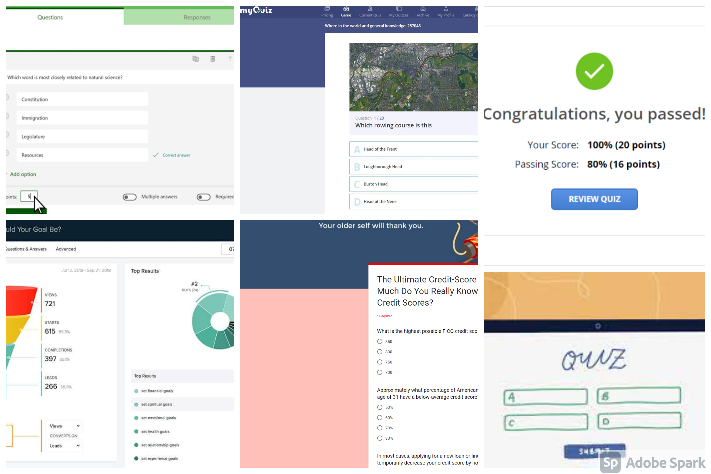
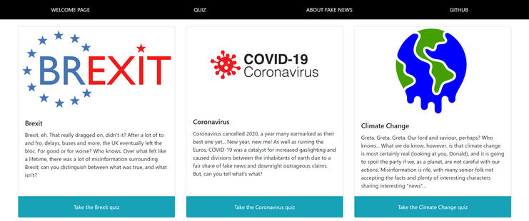
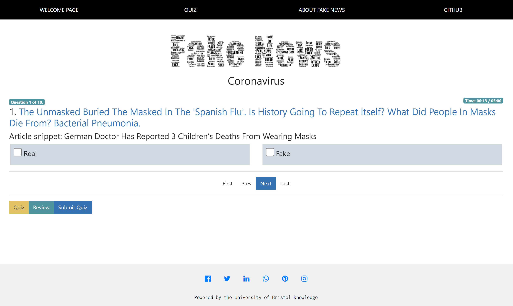

<h1 align="center"> System Implementation </h1>

## Table of Contents

- [Software Development Process](#software-development-process)
   - [Software Development Lifecycle](#software-development-life-cycle)
   - [Agile](#agile)
   - [GitHub Continuous Integration](#gitHub-continuous-integration)
- [Sprints](#sprints)
   - [Sprint 1 : Webpage Design & Initial Feedback (01.03.21-07.03.21)](#sprint-1--webpage-design--initial-feedback-010321-070321)
   - [No Sprints : Continue Working On Workbooks (08.03.21-21.03.21)](#no-sprints--continue-working-on-workbooks-080321-210321)
   - [Sprint 2 : Market Research & Deploying Boilerplate (22.03.21-28.03.21)](#sprint-2--market-research--deploying-boilerplate-220321-280321)
   - [Sprint 3 : Prepare Backend & Additional Wireframe (29.03.21-04.04.21)](#sprint-3--prepare-backend--additional-wireframe-290321-040421)
   - [Sprint 4 : Build Frontend Webpages & Begin Linking Front and Backend (05.04.21-11.04.21)](#sprint-4--build-frontend-webpages--begin-linking-front-and-backend-050421-110421)
   - [Sprint 5 : Further Front and Backend Integration (12.04.21-18.04.21)](#sprint-5--further-front-and-backend-integration-120421-180421)
   - [Sprint 6 : Write-up & Minor Frontend Amendments (19.04.21-07.05.21)](#sprint-6--write-up--minor-frontend-amendments-190421-070521)
- [MEAN Stack System Implementation](#mean-stack-system-implementation)
   - [Stack Architecture & System Design](#stack-architecture--system-design)
   - [Back End : MongoDB](#back-end--mongodb)
   - [Middle Tier : Express, Node, RESTful API](#middle-tier--express-node-restful-api)
   - [Front End : Angular](#front-end--angular)
   - [Deployment Details](#deployment-details)
   - [Additional](#additional)

## Software Development Process
A software development process can be seen as the application of divide and conquer whereby the development process is divided into smaller, parallel steps or subprocesses. Doing so helps improve the design and management of a project. Given that we, as university students, had other commitments and modules, we were aware that we would have to manage the project development in a flexible manner, and in a fixed amount of time. Unlike in the professional world, we could not get extensions. 

Due to these constraints, we first sought out a strategy to apply to our work approach. We knew little and often would be beneficial, ensuring a smoother journey towards a minimal viable product. For that reason we set out to compare and contrast the industry standard software development life cycle methods in order to find our approach.

To help manage workloads, we split up into separate, but closely linked, front and backend teams. Daniel Davies, Jack Pike and Harry Smith made up the frontend and Nathan Taylor and Vincenzo Gibliaro on the backend team.

### Software Development Life Cycle
[ADD TO/REMOVE] - Discuss SDLC framework/ideas etc. 

### Agile
[ADD TO] - Discuss agile and benefits vs Waterfall and why we chose it.
[ADD TO] - Group working methods used (for instance did your team choose a particular style of agile? what communication channels did you use?)

### GitHub Continuous Integration
In order to implement continuous integration and deployment within our project, we decided to follow some of the [DevOps Best Practices](https://www.atlassian.com/devops/what-is-devops/devops-best-practices), whereby developers make small frequent changes to a central repository, and test them. Imperative to aligning with these practices and our agile framework, is a source code version control system. We used GitHub as it meant any conflicts/errors could be managed, and our progress was being saved as we went; useful for if something broke along the way. 

Our reasons for using Git and GitHub, with reference to the Agile software development approach, are best outlined below.

We needed developers in the team to tackle tasks individually (alongside some pair programming). This allows for specialisation across team members, so they can focus on specific features in efficient manour. Key to this was organising *who* builds *what*. Discussions of this sort took place in team meetings, and are generally outlined in the meeting logs (front end and back end). GitHub's utilisation of **branches** effectively allowed us to adopt this methodology in our approach.

#### Branching

Initially, due to inexperience using the GitHub version control system, our branch network was disorganised. We started out by commiting initial project documents to the same branch, master (by default). This resulted in many merge conflicts. It was clear we needed to outline how to design a better system for collaboration. We then decided to make individual branches, that corresponded to each team member. Thus, our branch structure looked like:

```
master
dev
harry
jack
nathan
vini
dan
```

From this point out, we all pushed to our respective branches, and generally practiced merging into master.

Our final branch structure did not deviate too much from this, however, we needed to implement a **dev** branch. The reason for this, was that we wanted to have a separate branch in which we could implement tests that would mimic tests conducted by professional teams, just before deployment to live servers. This became our master branch.

We then agreed on a general workflow, which was formulated in Teams chats. This workflow looked like:

```
1. Agree on a feature to implement in your respective branch 
2. Build and test your feature by deploying the web application (either on your own or while pair programming)
3. Push your changes, providing an insightful commit message.
4. Merge your changes into dev.
```

There are some points that were revisited throughout this process:

- The second step was generally implemented by running the web application, and checking for error messages in logs. We can therefore claim that continuous integration has been met to some standard.
- The third step was one that we all stuck to. Throughout our commit history, our messages have been insightful and have provided a clear message to other team members. This is discussed in **good practice example**, below.
- This fourth step was the general procedure for updating the repository that all the developers in the team used to merge into their respective branches. Since we had agreed that our changes would be small and frequent, for timing purposes **pull requests** were not submitted in all commits.

Generally from the outset, there were some issues. We had merge conflicts, as expected, that were not handled successfully. There was one conflict, in which the solution lead to duplicate files being created across our repository. It was clear that not everyone had been using the correct workflow. We decided to go through the git workflow practice, from a technical standpoint, all in a live session. We could visually see the improvement in our workflow process via the Network interface on GitHub.

Here is an example of the idealised git workflow in action:


#### Branch Naming

The naming of our branches felt suitable for our application, as opposed to a branch for each feature, since our team was generally small, hence everyone would be making contributions across features. Having the branches labelled by name allowed us to speak with individual developers about commits they have made, if they had causes bugs. This proved particularly useful when merge commits occurred in dev, as the team members that were involved in the merge commit could easliy consolidate on a solution - when removing conflicting text in a file for example.

#### Pull Requests

As outlined above, pull requests were not commonplace for commits and merges into dev. This is a particularly useful practice in agile for teams, since other developers can discuss a particular commit, and decide whether it will merge with the current repository in a useful way. It would have been a good idea to implement this feature more frequently in our development process. Another reason we felt this was not always necessary, is that our team of 5 was split between front end and back end, and although branches were for individual developers, most tasks were done during pair programming sessions. Henceforth, the approval from other team members would be incorporated in the code.

One example when a pull request was necessary, and we decided to implement it. This commit consisted of a new page implemented in our single page application, this was the **About** page. We all reviewed this commit and approved it individually. Team members that worked on the front end generally looked at the implementation in code. Back end team members were looking at the content included in the new page. This pull request was labelled "**Stats page change**".

#### Good Practice Example

This section outlines where we saw good practices implemented in our workflow pay off. We had a major issue, in that the main **get** method called from the file **server/routes/api.js**. Somewhere along the commit history, this get method had been deleted. This required the use of the commit history interface on Github.com, and this issue was fixed easily via browsing through previous commit messages. As well as this, the backend team had coordinated who had done what with respect to this file. This is where our branch naming and commit messages proved very useful.

As well as this, another good practice supported us in this solution. After a meeting with Marceli, we made some major changes to the backend. There was multiple commits across files. Since the commits were not as small as we first realised, we decided to make a new branch, called **updated_database** on one of our developer's local repository. We then pushed our changes, and merged with dev. We used this updated_database branch for reference when re-implementing the **get** method we had lost. We saw a very similar method in the updated_database branch, so we could be sure that this was the correct method we had lost.

## Sprints

As previously mentioned, as a team we were following an agile approach and so broke up our work into (mostly) week long sprints. Given that we all had an idea of the order to which we needed to approach the build, each sprints list of objectives were decided at the beginning of the sprint by assessing the current state of the project. Tasks were prioritised if they were required to continue development. 

By breaking the workload into manageable sprints, we were able to week-by-week slowly build up the product, adding in more features as we went. Any tasks that were not completed by the end of the sprint were noted and these were set as a priority for the next sprint (unless not pivotal). As we were working in self-organising teams (i.e. front and backend), during each sprint we often had regular, sometimes daily, standups and catch ups for each team to make sure we stayed on track. By doing this we were able to catch any potential issues early on and pivot if needed.

If you are interested in seeing our meeting logs and standup notes, please [see here](../Documentation/Meeting_Log)

### Sprint 1 : Webpage Design & Initial Feedback (01.03.21-07.03.21) 
During this week we had a reading week, and a break from new content on our modules. We used this as an opportunity to come together to have our first sprint. 

The goals of the first sprint were as follows:
- Brainstorm an initial webpage design.
- Develop a paper prototype design of what we thought our Fake News quiz could look like (to read more about our design processes and ideation, please see the [System Design page](SystemDesign.md)).
- Generate a SurveyMonkey feedback questionnaire for our paper prototype ([see here](../Documentation/Paper_Prototype)).
- Familiarise ourselves with GitHub and continuous integration best practises.
- Amalgamate some potential datasets.

Due to the early nature of this sprint, it was heavily focussed on coming up with an initial website design and converting this into a paper prototype so that we could present it to friends and family for early stage feedback. During the design session we brainstormed ideas about what we thought made a quiz engaging and interactive. Given todays day and age, the trend for website seems to be a quite refined, simplistic design, and we thought that the same would apply for a quiz. Having loud, in your face pages can be distracting and take away from the message/aim of the page. Further discussions centred around what other successful websites with quizzes had done and we spoke about what works well about these webpages (e.g. Gapminder). 

Using the takeaways from the design sessions, we were able to develop a paper prototype and relevant questions based off this paper prototype. We had all agreed early user feedback would be beneficial for creating a minimum viable product that works well and is aesthetically pleasing.

Allowing time in this sprint to play around with GitHub also proved beneficial to hit the ground running on the documentation of the project, especially as we had little-to-no experience with it prior to this course. And thinking about and pulling together some potential data sets we saw as a good idea in order to help with the technical side of things further down the line.

### No Sprints : Continue Working on Workbooks (08.03.21-21.03.21)
During this time we worked on other university commitments whilst continuing to follow along with the Software Engineering workbooks and lectures, all the while meeting up to take note of ideas, thoughts and design conceptualization.

### Sprint 2 : Market Research & Deploying Boilerplate (22.03.21-28.03.21)
The second sprint was a brief, achievable sprint that coincided with the last workbook that was required to fully deploy the boilerplate Angular dashboard. We also used this sprint as an opportunity to carry out some market research before the start of the Easter break, where we had foreplanned to have 3 substaintial sprints. Carrying out this market research prior to the break meant that we could go into the forthcoming sprints with fresh ideas for the next round of feedback, wire frame design and building out the webpage.

Key goals:
- Have all team members individually successfully finish boilerplate deployment workbook.
- Upload a complete boilerplate dashboard to GitHub repo for further development.
- Carry out more substantial market research.

As this was also deadline week for another assignment, this sprint was deliberately brief, but was decided with good intentions. Having all teams members at the same level of understanding, regarding the full stack deployment, going into 3 weeks of sprints where we expected to achieve a lot, in terms of advancing the front and backend, would be hugely beneficial. With everyone at the same level, it would mean that if additional resources were required at either end, we would be able to pivot and share the load better amongsts ourselves. Further, with a fully working dashboard up on the GitHub repo, we would be in good stead to hit the ground running for further development on the quiz for the first sprint of Easter.

The documented market research can be found [here](../Documentation/BackgroundResearch/Market+Field_Research.md). Here, we looked into the surrounding field, and our motivations for our web application. In summary, the section explains how fake news can contribute to the detriment of social health, and cost to companies that are the burden of fake news stories. Further, we found no web applications that offer what we have set out to create.

| Stakeholders            | Updated Use Case        |
| ------------------------| ------------------------|
| Donald (End-User)       | I have access to a website, but it does not yet show me anything about fake news, or let me take a quiz. |
| Neil (University Professor)       | It doesn't look like there are too many websites out there that let visitors learn about and test themselves on fake news. |
| Emma (Admin)       | With the market research done, I have a better idea of what quiz topics to give users the option of taking. |

### Sprint 3 : Prepare Backend & Additional Wireframe (29.03.21-04.04.21)
Sprint number 3 came in the first week on Easter and the key goals related to advancing our paper prototype into a more developed wireframe and develop the backend with respect to the mongoDB containers and finalizing the dataset with sample questions, broken down by news topic. Further we set a stretch goal to prepare the data model for handling HTTP requests.

Key goals:
- Finish hand-made quiz dataset, broken down into various topics ready for linking to the front end.
- Prepare mongoDB container ready for HTTP requests.
- Create a more developed wireframe, implementing the feedback from the initial paper prototype SurveyMonkey questionnaire.
- Send out new wire frame and questionnaire for further front end feedback.
  
For the front end, the focus was taking onboard the feedback obtained from the SurveyMonkey questionnaire that was previously sent round based off the initial paper prototype. The feedback proved to be useful, especially points focussed around UI and UX, such as the navigation being intuitive and consistent, colour scheme and suggestions for a social sharing feature. As well as taking onboard UX and UI feedback, we also received reasurring feedback that the idea was liked by respondents and that they were interested to use the webpage and take the quiz. With this feedback, we also made our first interactive wireframe.

As our first real coding sprint, we experienced some implementation issues on the backend. We were previously using proxy data for testing the backend, but now that we were trying to make the backend utilise MongoDB, storing the data caused some trouble. On reflection, however, it proved a useful learning experience.

| Stakeholders            | Updated Use Case        |
| ------------------------| ------------------------|
| Emma (Admin)       | Thanks to the user feedback, I have a better feel for what users want from their experience on Would They Lie To You? allowing me to create appropriate quizzes. |

#### System implementation issues:

| Stack Part  | Goal        | Issue | Fix |
| ------------| ----------- |-------|-----|
| Backend     | Store persistent data in a dockerized mongoDB container | Data was not persisting when creating and running scripts to insert data and deploy docker | Trial and error, Googling and a deep dive into the scripts to ascertain root of the bugs |

### Sprint 4 : Build Frontend Webpages & Begin Linking Front and Backend (05.04.21-11.04.21)
Sprint number 4 saw the team coming together to start linking the frontend and backend. On the front end, work was done on highlighting what was, and what wasn't, needed from our selected quiz framework, in order to ascertain how we would tailor it to our liking. New pages and navigation were also added to the website. On the backend, the team finalised the data model schema and created mongoose commands to return the correct JSON payload, ready to be used by the quiz for questions.

Key goals:
- Start stripping out unused features from quiz framework.
- Add new pages and features to frontend, e.g. landing page, stats page, navigation, social sharing.
- Start linking up the front and backend.
- Finalize question data model schema appropriate for integration into front end.
- Create mongoose commands for JSON payload retrieval.

At the start of the sprint, the frontend team got together for a pair programming session to start streamlining the code ready for database integration towards the end of the sprint. However, it quickly became clear that the quiz framework that we had hoped to use was far too complicated for our use case. It was decided between us that we would need to pivot and find a new, simpler framework instead (see the [System Design page](SystemDesign.md) for more on this).

Collaboratively, the front and backend team also worked together to refactor the typescript quiz and backend data models so that the quiz service files that operated the questions in the quiz worked. Some difficulties arose but they were eventually ironed out.

On reflection of the sprint, it was a productive week, despite the front end quiz framework setback, with lots of movement on all fronts. There was good collaboration between the front and backend in starting to get the database linked up to the front end so that questions for the quiz could be dynamic. We were now in a position to start work in the next sprint on requesting, and presenting, the data from the database in the quiz.

| Stakeholders            | Updated Use Case        |
| ------------------------| ------------------------|
| Donald (End-User)       | I can visit the website and take a generic quiz, but I cannot chose between any topic. There is also a nice welcome page to read a bit about fake news on and navigate around the site from.|
| Neil (University Professor)            | I can now share the website amongst my class for them to take the fake news quiz. This is great and will help raise awareness. |
| Emma (Admin)            | The database and quiz questions are set up in the backend of our systems, we just need the front end to be able to access the data, as opposed to using a proxy dataset. |

#### System implementation issues:

| Stack Part  | Goal        | Issue | Fix |
| ------------| ----------- |-------|-----|
| Backend     | Setup data model schema | Data models were not aligned with frontend format required for quiz | Liaised with front end to reformat data |
| Frontend    | Setup quiz framework in frontend | Quiz framework selected was too advanced | Found a new framework that was more appropriate for our ability |

### Sprint 5 : Further Front and Backend Integration (12.04.21-18.04.21)
In this sprint, the team hoped to finally have a fully integrated front and backend by the end so that general housekeeping and tidying up could begin. On the front end, a quiz topic selection page was created so that the end user could pick between any of the five different set of quiz questions. The backend team also investigated the possibility of returning a single topic set of quiz questions at a time, as opposed to all questions at once.

Key goals:
- Inject a data service to the frontend. 
- Subscribe the quiz framework to the API JSON payload output.
- Add a quiz topic selection page.
- Return mongoDB data topic by topic, as opposed to all at once.
- Implement method to keep track of number of times questions were answered correctly.

Great progress was made during the sprint. During the week, the frontend team were able to utilize the API that the backend team had developed in prior weeks. By using the JSON payload returned from the API, the frontend team created a data service to subscribe the front end to. With the API data now being automatically fed into the frontend, the team could then update the quiz component classes so that the individual quizzes were loaded into the quiz framework. By creating this link, the team had a fully operating MEAN stack web quiz.

In this sprint, the backend team also investigated upgrading the API so that it would only return the required quiz questions when a topic was selected on the topic page. The backend team were able to implement this, but upon further discussion with the wider team, we decided that the preferred method was to request all quiz topics at once and let the quiz framework decide which questions to access. Further, the backend team investigated implementing a user story we had been striving for since the first paper prototype; adding a, e.g., "76% of users got this question wrong" at the end of each question. This proved to be too difficult, despite consulting with the TAs, and was ultimately dropped.

At the end of the sprint, the team were in agreement that we were all happy with the product and how it operated. The team agreed that the current state was our minimum viable product, and every improvement from here would be an added bonus!

| Stakeholders            | Updated Use Case        |
| ------------------------| ------------------------|
| Donald (End-User)       | Great, I can now use the website to take different fake news quizzes on 5 topic areas. Further, I can educate myself and view some interesting stats on the matter. Sadly, I cannot see how many other people got the questions right, but I can share my scores on social media.|
| Neil (University Professor)            | There is a well formed "About Fake News" page on the website now. My students can now begin to better educate themselves on fake news. |
| Emma (Admin)            | Unfortunately I cannot view how many of our quiz takers got each question right. This would've been helpful for deciding how hard to make future quizzes. I can, however add new quiz topics to the website, should I wish too. |

#### System implementation issues:

| Stack Part  | Goal        | Issue | Fix |
| ------------| ----------- |-------|-----|
| Backend     | Admin wants to view user question stats | Maintaining the state/count of number of times a question was correctly answered proved difficult. Persistence of the data kept getting lost | N/A - Dropped feature as it was proving too difficult to maintain the count of question attempts and answers. Unfortunately, this meant we were not able to fufill two of our user stores. |
| Frontend    | Linking up front and backend | Data sent through from API was not being picked up by the data service and thus no questions were being presented to the user. | Realized that the JSON payload from the API was being sent as an array of topics and questions. `quiz.component.ts` was refactored to access the correct array elements. |
| Frontend    | Selecting a quiz topic | Extracting the user's quiz topic selection to use it to load the correct quiz questions.  | Redirect user to e.g. `/quiz/brexit` via the routing module and extract topic from URL to pass into `loadQuiz()` method call. |

### Sprint 6 : Write-up & Minor Frontend Amendments (19.04.21-07.05.21)
After successfully linking up the front and backend last sprint, the team had a minimum viable product and were ready to start focusing on writing up the project alongside attending to any remaining backlog/formatting on the code base and website. The team also undertook a final round of user feedback in order to ensure any quirks/bugs were addressed and to see if there were any finishing touches that could be made.

Backlog of improvements at start of sprint:
- Add line chart onto fake news stats, plus any other stats ideas that arose.
- Code base tidy up; removing unused code and add comments.
- Minor frontend formatting.

By the end of the sprint... [ADD TO]

---

## Sprints and Project Management - 
---

## MEAN Stack System Implementation

### Stack Architecture & System Design
[ADD TO] - e.g. class diagrams, sequence diagrams. Might be best place/more detail in SystemDesign.md?

### Back End : MongoDB
#### SQL vs noSQL

Although we have pre-defined our DB schema, and checked for normalisation, we made the transition from an SQL schema to noSQL (mongoDB), in order to utilise the mongoose object modelling tool.

Initially, we ventured out designing a relational database for SQL because ...

- SQL performance - 
  - initially, we thought that as we had a rigid structure, that was unlikely to be changed, using the SQL framework for designing our DB schema was the best choice. 
  - We also thought that we would need to incroporate a lot more data for our site. 
  - After designing our schema with normalisation techniques, we realised that all of the data could be sorted into 4 schemas, with a majority of data entries being in 1 of those schemas.

The relative advantages of using SQL at this point were not so apparent, and we started to discuss what a noSQL version of our database may look like.

We vouched for switching to noSQL for the following reasons:

- usable 
  - we feel it would be easier to amend the data scheme using the mongoose object modelling tool. We feel that utilising a framework that resolves around using objects, as opposed to just pure data, would be more suited to the skills of the back-end team in this project.
  - this was supported by Purewal (Learning Web App Development, 2014), who stated that NoSQL data stores use the trade-off of storing some redundant information in "exchange for increased ease-of-use from a programming perspective". As well as this, Purewal discusses how NoSQL data stores are more useful for this reason in applications where "data reading needs to be more efficient than writing data". Since our application tends to read our mongo data a lot more than writing to mongo, we deemed this was a valid reason for utilising a NoSQL DB.
- scalable 
  - we read that  SQL struggles to cope with big data processing requirements (https://www.geeksforgeeks.org/sql-vs-nosql-which-one-is-better-to-use/). Although our SPA does not come close to utilising *big data*, we find that to future-proof our SPA, it would be wise to adopt a back-end which incorporates scalability.
- performance / speed 
  - although we do not necessarily avoid data duplication with noSQL, performing queries on single entities is generally faster than SQL. SQL is more suited to doing quick complicated queries on multiple entities, for example joins / sub-selects (https://www.geeksforgeeks.org/sql-vs-nosql-which-one-is-better-to-use/)

SQL Databases work best with schema that are long established and aren't prone to change - NoSQL benefits our project as there is scope for further development. As a single page application, there is always potential for improvements and new features. Therefore using a more dynamic, scalable database with NoSQL can benefit our project in the long term.

We have left the SQL DB schema in this [folder](../Documentation/Backend/DatabaseDesign/SQLDBdevelopment) for reference, and also to show our progression to our final DB design. 

#### Design of our data model (UML, tables)

Our data model was designed via the use of draw.io, in which we constructed a UML diagram to show relationships among our entities. We defined our final data model as being comprised of the following three entities:

- News Topics
- Quiz Questions
- Options

Quiz Questions are the entities which hold the core of our data for our web application. Each quiz question has the following elements:

- Headline - this is presented to the user, and is the headline of the fake news article.
- web_url - this is the web url of the news article. It is used in the answers section so users can view the fake news article.
- postData - this is the data in which the article was written. It is presented to the user with the question.
- text_body - this is a snippet from the article, in which the user can expand on their judgement of the news headline, in order to give their answer.
- correct_answer_url - this document can be null, and is given when an article is a fake news article. It is an article that either directly or indirectly debunks the fake news article in question
- Num_correct - this is one of the two statistics used to calculate the average number of users that got this quiz question correct
- Num_attempted - this is the other statstic 
  - note, we constructed these two statistics, and various methods to implement them in the answers section of our web application. We had the idea of making them dynamic, so that each time a question is answered, they are updated
- Options - this is an array of options (2 options for each quiz question)

Options are the entities that determine whether a user has answered a particular quiz question correctly. They hold:

- name - a String that is used to refer to that option object
- isCorrectAnswer - a boolean, where for each quiz question, for a particular option, true is selected if this option is the correct answer for this quiz question
- selected - this is set to false by default. If a user selects this option for a quiz question, selected becomes true.

The way we verify the user's response in terms of it being correct was conceptually quite difficult. Our design lead to a situation in which 4 option documents were created:

1. Option 1, name = "R_F"
2. Option 2, name = "R_T"
3. Option 3, name = "F_F"
4. Option 4, name = "F_T"

The syntax is described as follows:

```
OPTION <REAL/FAKE>_<FALSE/TRUE>
```

So, for each quiz question, there will be 2 options - 

OPTION<REAL>_<FALSE/TRUE>

OPTION<FAKE>_<FALSE/TRUE>

- if the quiz question is from a **real** news article, the 2 options for this quiz question will be as follows:

OPTION<REAL>_<**TRUE**>

OPTION<FAKE>_<**FALSE**>

- if the quiz question is from a **fake** news article, the 2 options for this quiz question will be as follows:

OPTION<REAL>_<**FALSE**>

OPTION<FAKE>_<**TRUE**>

Therefore, for a user's answer to be logged as correct, they need to select the option in which the second element is **true**.

Our third entity is News Topic. This includes the following documents:

- news_topic - a string, that defines the news topic, i.e., "Brexit". These strings are used in the landing page, when a user chooses a topic to do a quiz one. 
- Quiz_question - this is an array of quiz questions, that are related to this particular news topic.

News Topic is the entity that includes all the data we need, and it is from this we stem out and retrieve all our object and quiz question data. 

Our data model was designed from the idea of how the pipeline may look for a user's choice of news topic, to the data being presented to them on which they could see how many responses they got correct. From a high level view, the user chooses a news topic. From this, we can retrieve all of this quiz questions needed to do the quiz for the topic, along with their respective options - which will give them back data based on how they did in the quiz. 

We constructed the following UML diagram to visualise our data model:


From this, we can talk about the relationships we deemed necessary for our entities. 

The relationship between quiz question and news topic was clearly a 1 to many relationship. For each quiz question, there was one news topic it stemmed from. In light of one of our project aims, to educate user's about fake news surrounding particular global topics, we seemed it fitting that quiz questions did not overlap across news topics. We did this by keeping in mind the data we were going to collect. We wanted quiz questions that were clearly associated with a particular topic. The opposing relationship was clear too. For each news topic, there are multiple, and more than 1, quiz questions.

The relationship between quiz question was decided to be a 1 to many relationship. For each quiz question, there are 2 options, so this seemed fitting. There was difficulty in deciding the opposing relationship - since each option may be mapped on to multiple quiz questions. However, we decided that if it comes to a point where we need to access a quiz question from an option object, it may prove difficult. We therefore decided that each option should come from one quiz question, in order to isolate the question an option came from.

Following the construction of our UML diagram, we decided to make a spreadsheet to initiate ideas on what data we will be collecting, and to get a more solid understanding of the relationships between our entities. The spreadsheet is as shown below:


Throughout this data model design process, we adhered to conform to good data model design practices. Our previous model, which utilised SQL and its best practices (normalisation), was used to aid the design of our current noSQL model. Via this, we achieved a data model that did not unnecessarily repeat data. 

We also followed this guide, to cater our design choices to best practices:

https://developer.mongodb.com/article/mongodb-schema-design-best-practices/

- our data model is clearly one that uses an embedded design. This allows us to retrieve the necessary data we need for a larger data entity, like a news topic, with a single query. We also found it would be easy to access individual elements within this data type.
- rule number 5 in this guide also solidified our choice in catering out design to our application's data access patterns.

With respect to constructing our mongoose models, to be used when instantiating and loading collections, we created these [three models](../Example_Code/AngularQuizApp/models) that correspond to our three entities. These will be the three collections in our mongoDB database. We start by creating a mongoose schema, which defines all of the data entries for each collection. We then export these as a mongoose model. This is so they can be used with mongoose commands, for example finding a particular object in our database.

Note, in our quiz_question model, we also export the schema. This is to fix an issue we had in which embedded documents were being referenced by value, as oppose to referencing the actual objects themselves.

#### Collecting data 

It's critical for a web-app in this category to have accurate and *thought-provoking* data to utilise in order to make it as educational as possible. Our initial thought was to find ready-made datasets that would have formulated all our quiz questions. We found plenty of large datasets that were filled to the brim with articles - good and bad. Most of these datasets had outdated links, broken web-pages and irrelevant material. We wanted our quiz to have proper 'punch' at every question and the datasets found were not going to help us achieve that. Furthermore, the data was not organised in a manner that was useful to us; we are aiming to have a our questions categoriesed into News Topics that the user can choose from. This focussed approach allowed the user to experience how Fake News varies from topic to topic and allows a more comfortable learning exerience as a whole.

So without suitable datasets and no competent web-scraping systems to be seen, we decided to hand-pick the data ourselves making sure the articles were as deserving as possible to be featured in our quiz. This proved a trickier task than you'd assume. Google, being the world's most proficient search engine aims to phase out all fake news in order to give their users the most 'truthful' experience. This wasn't great for us, actively searching for bogus information.

It's worth mentioning that we also wanted to find **debunking** articles in relation to the Fake News we gathered. Venturing into the darkest (but not _too_ dark) depths of the internet, we came across some perfect examples of Fake News and gave the goal of having a mixture of **5 Fake News** articles and **5 Real News** articles for each of our **5 News Topics** that we had proposed.

Aside from the grind in acquiring the necessary data, we also found ways to improve other elements of our backend structure. We initially had a _Many-to-Many_ relationship between questions and news topics; however, refering to the underlying intent to make this as educational as possible for the user, we decided to alter this to a _One-to-Many_ relationship. This meant that there will no longer be multiple news topics related to a question, we intended to make each article as relevant to the news topic as possible - eradicating and vagueness.

#### Inputting data via insertDataScript

The mechanism we used to get data ready for use in our application consisted of two main steps: creating the database, and seeding the data from the database into a mongoDB container.

#### Creating a mongoDB database

The first step in allowing us to test our backend structure was to get the data we gathered into a MongoDB client to test how effective it was. We decided that rather than inserting our data within the MongoDB shell, we will aim to run a Javascript 'script' that would insert all this data using Mongoose commands - appropriately named [insertDataScript.js](./Example_Code/AngularQuizApp/insertDataScript.js). In short, the script injects into a MongoDB client (using a URL specified in args[0]), our data.

This script underwent many changes depending on our evolving decisions regarding backend structure but this final script allows us to unload our data into MongoDB ready for use. A reason why we decided to use import our data in this way because it makes it easier to add more data at a later date; i.e, the structure is there and it is set out into `createOption`, `createNewsTopic` and `createQuizQuestion` methods (amongst others). A simple '*copy + paste*' and '*fill in the blanks*' allows us to add more data whenever we need to. 

We needed to require the necessary models at the top of the script:

```javascript
const QuizQuestion = require('./models/quiz_question');
const NewsTopic = require('./models/news_topic');
const Option = require('./models/options');
```

It's worth noting that this script is ran privately and doesn't take part in the deployment of the docker container with [deploy.sh](./Example_Code/AngularQuizApp/deploy.sh). The script allowed us to export from a local MongoDB client into [three JSON files](./Example_Code/AngularQuizApp/blockData) that were prepared for seeding.

#### Seeding

The docker image we create is generally read only. Therefore, for the data to be used in our server, it needs to be stored somewhere that has read/write permissions. The issue that arises is that when someone, who doesn't have the data that we store, starts the docker container when running our application, the mount point is local to that person's machine. In other words, volume is mounted from a local machine, hence data from our own machine's will not persist. Therefore, we decided to create a script that would seed all the relevant JSON data into the dockerised mongoDB container. Thus, when the server starts, all this data can be read from this container using mongoose commands. 

We implemented seeding by issuing the three following commands in our script used to start up our application:

```bash
docker exec -i db sh -c 'mongoimport -u <OUR_USERNAME> -p <OUR_PASSWORD> --authenticationDatabase "admin" -c options -d db --upsert --jsonArray' < blockData/optionsOutput.json

docker exec -i db sh -c 'mongoimport -u <OUR_USERNAME> -p <OUR_PASSWORD> --authenticationDatabase "admin" -c newstopics -d db --upsert --jsonArray' < blockData/newsTopicsOutput.json

docker exec -i db sh -c 'mongoimport -u <OUR_USERNAME> -p <OUR_PASSWORD> --authenticationDatabase "admin" -c quizquestions -d db --upsert --jsonArray' < blockData/quizQuestionsOutput.json

```

### Middle Tier : Express, Node, RESTful API

#### Choosing REST

We decided to build a RESTful API to link our mongoDB database to our front-end (Angular). Generally speaking, REST is an interface between HTTP utilising systems, and it can be used to process data operations in many formats (i.e., JSON). 

REST stands for Representational State Transfer, and is commonplace in data exchange protocol systems used in web applications today. The REST architectural style determines how the API looks, and how it processes client requests. The main mechanism that RESTful APIs implement is that a resource, (i.e., a piece of data) is retrievable upon a client URL request. This is formally known as a response.

Responses are the result of requests. A response is composed of two parts - the root-endpoint and the path. The root-endpoint is the starting point from where your API lives. In our project, it is where we set the API routes from server.js (localhost:4200/api) - but we will come back to this. The second part of a response is the path. This path determines the resource the client is looking for. We can distinguish between different responses based on these two parts, and implement methods in our api that map responses on to the mongoose and node.js commands that will respond with the correct data from our backend. 

The main advantages of using a RESTful API is that each HTTP has all the information needed. In other words, neither the client nor the server need to remember any previous status to satisfy it (https://www.bbvaapimarket.com/en/api-world/rest-api-what-it-and-what-are-its-advantages-project-development/#:~:text=The%20REST%20API%20is%20always,%2C%20Java%2C%20Python%20or%20Node.). This means that we have a stateless client/server protocol. 

A RESTful API allows for client-server separation. This allows for scalability, since development teams can scale up the application without having to take down the server. Developers can work on the server side of the application, without the client side being affected.

For these reasons above, utilising the RESTful approach seemed appropriate. After making this choice, and setting up our mongoDB database, we started to think about the internals of requests, with relation to how they would interact with our database. REST APIs implement multiple operations (CRUD operations - create, read, update and delete) which are performed giving speicifc requests. We decided the main interaction with our database would come from a get request, in which our response (in the api) takes the form of a JSON payload, containing the data for all news topics (including quiz questions).

#### Implementing REST

To build our API, we used Express, one of the key frameworks in the MEAN stack. We started off by creating server.js, in which we require the express dependency. We also created the file api.js, as well as a folder called server. We then require the api in server.js. 

The whole point of this is that server.js which has all the server code that points to the server folder. Server.js also utilises POST data parsers from express. 

In api.js, we export the routes used by the router required. We creat an express router here, and we implement our main get command. The router is then exported and it's used by server.js. This allows the api to respond to client requests made on the server, from which are fed through to the api. 

Our main get method is as follows:

```javascript
router.get('/NewsTopics', async (req, res) => {
  console.debug('Executing /newsTopics endpoint.')

  res.header("Content-Type",'application/json');
  const newsTopics = await NewsTopic.find({})
    .then(results => {
      console.debug('NewsTopic(s) queried successfully!');
      console.debug(results);
      return results
    })
    .catch(e => {
      console.error('Error occurred in the NewsTopic query.');
      console.error(e);
    });
  res.send(JSON.stringify(newsTopics));
})
```

The process is as follows:

- Client enters the http request, which automatically requested when they choose a particular topic (i.e., when running locally: localhost:4200/api/NewsTopics) 
  - **localhost:4200/api** is the base path of the API endpoint
  - **/NewsTopics** is the path that corresponds to the specific method in api.js 
- This utilises the NewsTopic mongoose model that we require from ../models, and implements the mongoose method **.find**
- Since the result of this is a JSON string, it can be stored in a const
- We look for any errors, and if everything is okay, we respond to that request with a JSON payload (as a string) 

As we're exporting the router made in api.js, which is required in server.js, the output of this (when integrated with angular) is rendered on to the webpage.

Linking up the frontend to the API is achieved by creating a data service that <i>subscribes</i> to the API and is discussed in the frontend section below.

### Front End : Angular

#### Why Angular?

Our Front End infrastructure was implemented using the Angular framework. We chose this, not just because it was the framework being used for the course content, but also because of it's functionality out of the box. As a framework, it is very versatile and allows for a lot of features to be implemented without use of third-party libraries. As inexperienced developers, this seemed like a very important aspect, and thus we were happy to follow the guidance of the University and use this as our Front End, as opposed to trying something different.

Some other benefits that led us to use Angular are: 
- Typescript based language, therefore keeping our language across the full stack consistent, but also as it is a typed language, it allowed us to keep our code clean and understandable
- Unlike React, Angular is a fully-fledged responsive web design framework. As a result, there is enhanced consistency throughout.
- Angular provides a great deal of ready-to-use UI components and also has plenty of learning material.

#### The Website Design

During our design process, we had created paper prototypes and wireframes to design what we envisaged our website would look like. During this process (which you can read more about [here](/SystemDesign.md)), we had decided that our website would compose of:
- Welcome page
- The quiz
- Fake news stats page

To implement this, using the Angular CLI, we generated components that would allow us to build out the HTML, Typescript and CSS aspects of each page. These components formed the basis of our website and allowed us to repeat certain aspects of the website (e.g. toolbar and footer) without having duplicate code.

To build out the Welcome Page, we opted to use a pre-made HTML template, provided by W3Schools.com, and added new components to the HTML for the toolbar for navigation and the social footer. Navigation between the various parts of the website was achieved using the RouterModule from Angular that allowed us to set certain components as the end point of certain urls, e.g. `/about` would take you to the fake news info component.

<p align="center">
  
</p>

The meat of the website would be the quiz itself and to implement this we investigated building out our own quiz framework, or using a pre-made one and tailoring it to our needs.

**Choice and change of Angular Quiz Framework**

We spoke with the teaching support on the course about how best to approach implementing a quiz in Angular. On advise from Thomas Bale, we elected to find a pre-made quiz framework and repurpose it for our needs. To do this, we had a front end get together that involved a morning pair programming session sitting down to research, test and try different Angular quiz frameworks that might be suitable as a template for the purpose of this project. We looked at a number of different frameworks in depth including: [Eva Grean's](https://github.com/evagrean/quiz-app) and [Anurag Gandhi's](https://www.codeproject.com/Articles/1167451/Quiz-Application-in-Angular). We eventually decided we would use a fancy looking [Spotify app](https://awesomeopensource.com/project/fabiandev/angular-quiz-app). The reason we chose this framework was because it was aesthetically and functionally pleasing to interact with and thought it would help keep the content of the quiz engaging. Other frameworks we found felt a bit basic, whereas the Spotify Quiz had animations and progress bars, for example. 

Our next task was to familiarise ourselves with the Angular component structure that rendered the site, which we tried and tested over a few days. This quiz app even formed the basis of one of our rounds of user feedback. However, it was not until we made more concerted attempts to build out and refactor the code on this quiz we realised that this quiz was too advanced for our still relatively nascent experience of Angular. As such, we had to make a u-turn and thus settled on [Anurag Gandhi's](https://www.codeproject.com/Articles/1167451/Quiz-Application-in-Angular) quiz framework. Altogether it was much less complex and more malleable for what we had in mind to achieve.  There were sufficiently less components and the code was more simple to re-work and manipulate.  

During our research of Angular frameworks, we also took the opportunity to brainstorm some design ideas as a team about prospective designs for our quiz. This helped us to focus in on our needs and initiate the creative process of building up the single page application front end in our minds. 

We created this mood board to consolidate and draw ideas from:

<p align="center">
  
</p>

**Refactoring and restructuring to prepare for back-end code**

One of the major challenges for the front end was linking with the back end to load their .json file that would render our quiz questions and answers on the website. First, we had to refactor a lot of the models, service and component code on the front end, which included the removal of a lot of unnecessary variables. 

For example, the original `quiz.service.ts` looked as follows originally:

```typescript
import { HttpClient } from '@angular/common/http';
import { Injectable } from '@angular/core';

@Injectable()
export class QuizService {

  constructor(private http: HttpClient) { }

  get(url: string) {
    return this.http.get(url);
  }

  getAll() {
    return [
      { id: 'data/javascript.json', name: 'JavaScript' },
      { id: 'data/aspnet.json', name: 'Asp.Net' },
      { id: 'data/csharp.json', name: 'C Sharp' },
      { id: 'data/designPatterns.json', name: 'Design Patterns' }
    ];
  }

}
```

The three main models were all refactored also to prepare for the new JSON: `question.ts`, `quiz.ts` and `option.ts`. 

New `option.ts`:

```typescript
export class Option {
    id: number;
    questionId: number;
    name: string;
    isAnswer: boolean;
    selected: boolean;

    constructor(data: any) {

        data = data || {};
        this.id = data.id;
        this.questionId = data.id;
        this.name = data.name;
        this.isAnswer = data.isCorrectAnswer;
        this.selected = data.selected;
    }
}
```

At the beginning, we could not link the back end json file with the front end. This was due to an extra variable within the "options" called "optionR_F" or "optionF_T" that made it very hard to access the data. As shown below:

```typescript
"options":
               [
                  {
                     "optionR_F":{
                        "_id":{"$oid":"606ef4311a70c9229fa6c772"},
                        "name":"Real",
                        "isCorrectAnswer":false,
                        "selected":false,
                        "__v":0
                     }
                  },
                  {
                     "optionF_T":{
                        "_id":{"$oid":"606ef4311a70c9229fa6c773"},
                        "name":"Fake",
                        "isCorrectAnswer":true,
                        "selected":false,
                        "__v":0
                     }
                  }
               ]
```

Eventually, we managed to link up with the back end after lengthy communication between the two teams to produce this working format for the quiz framework:

```typescript
 {
    "topicName": "JavaScript Quiz",
    "quizquestions": [
        {
            "id": 1010,
            "headline": "A first fake news headline",
            "web_url": "www.fakenewswebsite.com",
            "postData": "2021-04-08",
            "text_body": "......fake text.......", 
            "correct_answer_url": "<leave me blank for true headline questions>",
            "num_correct": 10,
            "num_attempted": 20,
            "questionTypeId": 1,
            "options": [
                {
                    "id": 1055,
                    "name": "Real",
                    "isCorrectAnswer": false				
                },
                {
                    "id": 1056,
                    "name": "Fake",
                    "isCorrectAnswer": true					
                }
            ]
        },
```

#### Building up Angular features

After the relevant data models had been refactored, using a dummy JSON file, we were able to populate the quiz with our questions to test that it worked. Next we worked on reformatting the quiz so that it had some extra features.

With each question, we wanted to present an article link and snippet to inform the quiz takers decision on whether the article was real or fake. This involved adding code to quiz.component.html file:

```html
<h3 class="font-weight-normal">{{pager.index + 1}}.
    <a href="{{question.articleURL}}" target="_blank">
        <span [innerHTML]="question.name"></span>
    </a>
</h3>
<h4 class="font-weight-normal">Article snippet:
    <span [innerHTML]="question.articleBody"></span>
</h4>
```
Further, for fake articles, the JSON payload included article links that debunked said article. After completing the quiz, we wanted to present this to the taker so that they could see why the article was deemed fake. However, for the real articles, no link was provided so we had to implement conditional statements to only present the link if the article was fake. To do this, we utilised Angulars built in ngIf feature:

```html
<div class="result-question">
    <h5>{{index + 1}}. {{question.name}}</h5>
    <div class="debunk" *ngIf="isRealFake(question) == 'fake'">
        <h6>This article was fake,
            <a href="{{question.debunkArticleUrl}}" target="_blank">click here to debunk it!</a>
        </h6>
    </div>
    <div class="row">
        <div class="col-6" *ngFor="let Option of question.options">
            <input id="{{Option.id}}" type="checkbox" disabled="disabled" [(ngModel)]="Option.selected" /> {{Option.name}}
        </div>
    </div>
    <div class="p-1 m-2 alert {{ isCorrect(question) == 'correct'? 'alert-success': 'alert-danger'}}">Your answer is {{isCorrect(question)}}. This was article was {{isRealFake(question)}}.</div>
</div>
```
We also added features that shuffled the questions each time by editing the `quiz.ts` model to randomly push questions from the JSON payload into the question array that was used in the `quiz.component.ts`. Right now this wasn't a major feature, as each quiz topic only had 10 questions, but further work could include larger question databases and shuffling the questions would keep the users experience fresh.

```typescript
shuffle(array) {
  let currentIndex = array.length, temp, randomIndex;

  while (0 !== currentIndex) {
    randomIndex = Math.floor(Math.random() * currentIndex);
    currentIndex -= 1;

    temp = array[currentIndex];
    array[currentIndex] = array[randomIndex];
    array[randomIndex] = temp;
  }
  return array;
}
```

With the quiz fully operable based on our JSON formats, we then had to implement features into the HTML and Typescript that would allow the user to select which quiz they wanted to take. Having been previously made aware of the HTML Bootstrap framework, we opted to make use of the cards classes to make the topic selector page visually appealing.

<p align="center">
  
</p>

To actually implement the topic selection, we created a new path in the `app-routing.module.ts`:
```typescript
 { path: 'quiz/:id', component: QuizComponent },
```
Using this path, when the user clicked on a topic, the URL would change to e.g.: `quiz/brexit` and present the quiz using Brexit questions. In order to have the quiz load the correct questions, based on the url address, the `quiz.component.ts` `ngOnInit()` `loadQuiz()` methods were re-worked.

Extracting the quiz name from the URL like so:
```typescript
ngOnInit() {
    this.quizzes = this.dataService.getQuizNames();
    this.quizName = String(this.route.snapshot.paramMap.get('id'));
    this.loadQuiz(this.quizName);
  }
```
allowed the quizName to be passed into the loadquiz() method and select the right quiz from the JSON payload.

#### Connecting To The API

Earlier work, mentioned above, had been done on aligning the backend data formats with the frontend quiz framework data models. As a result of this, the frontend quiz data could be retrieved from the API payload, as opposed to using a dummy JSON file.

To retrieve the API, a new `data.service.ts` was generated using the Angular CLI. In this service, a `getAll()` method was created that utilised the HTTPClient module from Angular to make `HTTP get requests`. By using a `get` request, all the data provided on the given URL could then be returned. As mentioned earlier, the JSON payload was hosted at `http://localhost:4200/api/NewsTopics` so a HTTP request was made as such:
```typescript
private REST_API_SERVER = "http://localhost:4200/api/NewsTopics";
```
```typescript
public getAll(){
    return this.httpClient.get(this.REST_API_SERVER)
  }
```

This data service could then be injected into whichever components needed access to the data. In our case, only the `quiz.component.ts` needed access to the JSON. All that was left to do was use the data service component to call the `getAll()` and `subscribe` to the data. This meant that if the data changed, or was updated, it would be updated on the frontend - a useful feature for is the questions were to change.  

As the JSON was arriving as an array of quiz topic questions, to access the individual topics and present them to the user, based off what topic they had selected, a check on the quiz name is performed before loading the JSON into the quiz itself:
```typescript
 loadQuiz(quizName: string) {
    this.dataService.getAll().subscribe(
      res => {
      if (quizName === 'Brexit') {
        this.quiz = new Quiz(res[0]);
        this.quiz.name = quizName;
      } else if (quizName === 'Coronavirus') {
        this.quiz = new Quiz(res[1]);
        this.quiz.name = quizName;
      }
      ...
```

The end product looked as follows:

<p align="center">
  
</p>

#### Additional Webpage Features

As this was a <i>serious play</i> project, we also wanted to have an area of the website that would help educate the users and also have social sharing features so that awareness could be raised.

To the footer we added a number of share buttons for the most common social media platforms and to the toolbar we added a link to an `About Fake News` page. On this page we talk about he history of fake news and how one can better protect themselves from it's effects.

# Deployment Details

### **Continuous Integration**

To align with agile working principles, we opted for continuous integration when developing this project. Small incremental progress in the form of frequent commits on our git repositories allowed both for a tangible goals to be realised more easily and for constant revision of our progress. Mentally, this method of working helped to compartmentalise big tasks to make the project at large seem less insurmountable.    

#### Integration across FrontEnd and BackEnd

Generally, to implement continuous integration, consolidation between the backend team and the front end team was imperical. As highlighted above, the main integration came from pulling together files from AngularDemoSite and AngularQuizApp, which were at the time two struturally separate projects. We felt initially that it would be best for the backend team to work on AngularDemoSite (which was built upon a skeleton framework of a MEAN Stack project), and for the frontend team to work on AngularQuizApp - which was a quiz framework, focusing mostly on angular. For continuous integration to apply, team meetings were held often. We had **weekly stand-ups** (the notes for these are in ../Documentation/Meeting_Log/Standps, in which the both teams would present their work, and notes would be taken for reference to the counterpart when specialising in their own work. We feel this lead to an easier integration among the two projects. An example of when this came in to effect was creating the Options model in the MongoDB database. 

---

##### Effective Integration Example

The issue arose since the backend team were advancing out of sync, since the frontend side of the project meant a lot of research had to be done in order to find a framework to build on. For the backend, guides were used (https://developer.mozilla.org/en-US/docs/Learn/Server-side/Express_Nodejs/mongoose, https://www.madetech.com/blog/migrations-seeds-and-pipelines/) that showed clear and good practices of mongoDB construction. These models built were refurbished multiple times. When the frontend team found a framework, the backend team needed to implement an Options model. Specifically, this Options model would incorporate 4 different instances, and it would be the document embedded in a particular quiz question which would allow for the user's answer to be checked against the correct_answer (boolean) field in a payload. Henceforth, files like insertDataScript, and new files in models/, needed to be changed to incorporate the need for this new model. As well as this, the backend team needed to revisit the schema diagrams, to verify the relationships that would need to be updated. The main relationship of question was between quiz_question and option. All of this was done with reference to a JSON payload that was given by the frontend, in order to get a JSON output from our API to match this. One issue was that the option document name was displaying in the output, which meant all the fields incorporated in a particular option document were not accessible by the front end. This last fix was solved (in insertDataScript.js) by including the actual fields of an option in a quiz question as opposed to embedding the actual Option document. We figured this was good practice since we are only referencing the Option documents as value. We do not need to update the fields in Option. 

We felt this issue was solved efficiently, and was aided by the weekly stand-ups and constant communication across both teams. Additionally, members from opposing teams helped out in order to make sure the frontend needs were met by the backend for this particular issue.

---

Another implementation of continuous integration was our project pipeline on GitHub. Details on the design of our workflow is outlined in the **Sprints & Project Management Section** of this writeup. In essence, to circumvent the common occurrence of a merge conflict, we created a branch for each team member to do work on. When splitting the team members into specialised development roles, and the backend and frontend team generally worked in two separate directories. This meant that any conflicts caused generally when working in these directories were caused by members of the same 'team'. This meant that any details left out of stand ups, specific to teams' individual tasks, were not entirely dealt with a counterparty member. 

### **Deployment with Docker**

Deploying our new quiz framework with Docker involved integrating what we had achieved and learnt through the Angular Demo Site with our new Angular Quiz Framework.  We had to first move across all the relevant files that supported the docker container ecosystem and the MongoDB such as deploy.sh, blockData, wait-for.sh, insertDataScript.js and others.

Utilising Docker generally meant that we get a reproducible build environment, a flexible project which can migrate across operating systems, and could be tested in a clear and informative way. The files **docker-compose.yml** was included in the Docker build, which ensured the helpful features that Docker offers were implemented to the build process. The **Dockerfile** was also integral to our build process. This text document has all the commands a user can call on the command line to build an image (instance of a container). This **Dockerfile** executes multiple commands (like a script) in succession. We use these files for building our Node and MongoDB Docker containers. 

We encountered some issues that continuous integration aided in the deployment of docker. Some key features of our repo in light of deployment with docker are highlighted below.

##### Wait-for

Since our project design meant that we needed to have two running containers: a Node one and a mongoDB one, we needed to ensure that we have a mongoDB image running before it is connected to a Node image. The solution for this was implementing a **wait for** script. We needed to download this, and our source is illustrated below:

```bash
$ wget -O wait-for.sh https://raw.githubusercontent.com/eficode/wait-for/master/wait-for
chmod +x wait-for.sh
```

- Then, in the docker-compose.yml, we implemented the running of this wait-for script in the command section (in services)

- The line is repeated below:

  ```sh
  command: ./wait-for.sh db:27017 -- /home/node/app/node_modules/.bin/nodemon server.js
  ```

- This line is for the node instance. It waits for the mongoDB container to be running (which exposes port 27017), and following this it starts up the node container.

##### MongoDB Credentials

Since we want our database to be secure, we needed to provide the login credentials in a way that was not exposing to the public. We created a file (which was left out of this repo for obvious reasons), which displayed our credentials. We specified the field **environment** in the db image section of the **docker-compose.yml** script, which specified where the mongoDB container can get the credentials, so we can automatically log in when running this script.


##### Integrating Docker Commands and Fixing Merge Conflicts - AngularDemoSite -> AngularQuizApp

Initially we had some difficulty in rendering the new framework with the docker container. This was for myriad reasons. We had to change some dependencies in package.json and package-lock.json which resulted in merge conflicts which were tricky to solve. Another issue we had was that originally we serving our new application with the command npm serve - which was not ideal for the docker container. As such, we installed some further dependencies to ensure the application would be rendered with ng build.  However, the application would not work still. As such, Harry and Jack set up a Teams  pair programming call to run over the changes that had been made and after a good session we realised that we had to tweek a static path in the server.js file. Once we solved this issue, we were jubilant to deploy our full stack through docker. 

Resolving this path issue was the key to full stack deployment through Docker:

```javascript
// Point static path to dist (folder where build files are located)
app.use(express.static(path.join(__dirname, 'dist/ng6-quiz')));
```

##### Docker Volume Fix

Another docker issue, encountered by the backend, was that since Docker mounts volume locally, we needed somewhere to store the data and then import this into MongoDB. This was more of a lesson in how Docker works, but the result - *creating an InsertDataScript to get JSON files for our models, and then importing them in deploy.sh* - lead to a situation where the correct data would be in the mongoDB docker container every time we run deploy.sh. Furthermore, due to the internals of Docker, the libraries and dependencies used for mongoDB will be the same for anyone who starts our containers. This aided continuous integration and deployment as it rules out any errors that may have occurred due to discrepancies across mongoDB software versions. 

##### Slow Build Process Fix

We found that the build process for docker could take a while in most cases, and this slowed down development, and made pair programming techniques almost redundant as we would make small changes, and spend most of the time waiting. We consulted with senior members of staff, as highlighted in the backend meeting log, and fixed up a version of docker-build which could be run local. This process built docker in a similar way, using port 27018, and used the LOCAL fields in the **.env** file. Some other changes include:

- having a check in **server.js** to see if we were running locally or not - if we were, module dotenv is used which gets the correct .env credentialy 
- in **db.js** we created local and container URLs which gets used whether we're using the local or the container's mongoDB database.

To run this local build process, we simply ran:

```bash
$ npm run local

# local is a script defined in package.json 
# it runs:
	$ docker-compose up -d
	$ node server.js IS_LOCAL
	# IS_LOCAL is the flag used to signal we want to run locally - telling server.js what 		port to use
```

We agreed, to liase with continuous integration principles, we would only make small changes when running locally - for example bug fixes. This was core to using the local deployment of docker, since we felt it best that bigger changes - for example those that affected project structure, or a new feature - would be run in the full docker build version. Deploying docker in a lighter way helped improve the effectiveness of pair programming sessions.

---

##### When done testing, can talk about continuous deployment/delivery here

- can also talk about docker logs - ie manually inserted so console.debug stuff too to get clear idea of errors 

---

Utilising continuous integration and deployment throughout the project, with an agreed-upon build process and error checking methodology, we felt our project development process ran smoothly. We also feel that the use of Docker would allow for further development in the future, either by us or others. This is due to the reproducible build environment and persistent storage that these principles and softwares assemble.

---

### Additional
[ADD TO] - Additional elements and components e.g. authentification. Tell us about any other aspects not covered above!

- [Previous Section: System Design](SystemDesign.md)
- [Next Section: Project Evaluation](ProjectEvaluation.md)
- [Back to Top](#table-of-contents)
- [Back to Home](../README.md)
